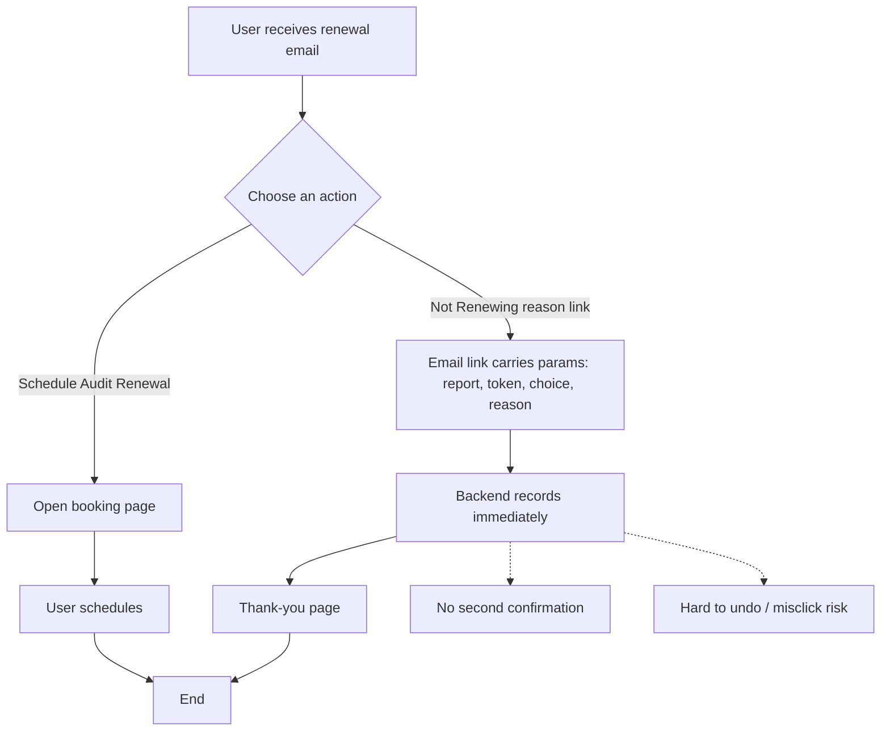

# PRD Patterns — distilled from QIMA PRDs

Reusable patterns extracted from QIMA PRDs and product-decision documents by Suki Yuan, Matt Cai, Pierre Rioual, Eric Wang, and Bindu. Use these as templates during Phase 4 drafting and Phase 4.5 depth-pass; use `human-prd-writing-style.md` for the writing voice gate.

Core surveyed PRDs:
- QIMAlabs Master Data, Test Setup & Report Generation — Confluence 3354165416
- Multilingual Report with AI Translation — Confluence 4574412846
- Interactive Lab Testing Report PRD — Confluence 4439343118
- Package Charge Management — Confluence 4379607054
- IRP Inspector Sync to QIMAOne — Confluence 4605902887
- QIMAlabs First Page — Confluence 3374219285
- QIMAlabs Access Management — Confluence 3374022742
- QIMAlabs Report Summary List — Confluence 3380412417
- Report Email Configuration for Interactive Report Adoption — Confluence 4408016912
- Protocol Maisa Worker — Quotation & validation — Confluence 4137910309
- myQIMA Expansions 2026 — Confluence 4409393156
- Life Sciences Back Office PRD — Confluence 4434526211
- Corrective Action Plan Workflow System — Confluence 3626958849
- Specification for 2nd party audits — Confluence 3428286511
- Ericsson Desktop Review Data API Integration — Confluence 4384063510

---

## Pattern 1 · Parallel state machines per entity (strengthens D1)

When the feature involves a workflow with multiple entities (Report, FP, Test, Department, PDF, Order, etc.), do NOT collapse states into one timeline. Enumerate **one state machine per entity** with explicit transitions and triggers.

**Template** (per entity):

| From state | Trigger | To state | Side effects |
|---|---|---|---|
| Initial | user submits draft | Awaiting submission | notify reviewer X |
| Awaiting submission | reviewer approves | Under review | lock fields A,B |
| Under review | reviewer rejects | Requires resubmission | unlock + email submitter |

**Pass criterion**: every state listed in D1's 7-state checklist is reachable via at least one labeled transition; every transition names its trigger AND side effects.

**Origin**: QIMAlabs PRD §5.4.2 — separate state machines for Report / FP / Test / Department / PDF.

## Pattern 2 · Scenario matrix as primary AC form (strengthens AC quality)

For any FR involving an algorithm, distribution, allocation, calculation, or branching logic, the AC SHOULD be a table where each row is one edge case with the exact expected output — not just one Given/When/Then.

**Template**:

| # | Scenario | Inputs | Expected output | Notes |
|---|---|---|---|---|
| 1 | even split | 4 inspectors, 8 reports, all eligible | I1→[R1,R2], I2→[R3,R4], I3→[R5,R6], I4→[R7,R8] | round-robin |
| 2 | odd split | 3 inspectors, 8 reports | I1→3, I2→3, I3→2 | remainder to first N |
| 3 | one inspector ineligible (MD=0) | 3 inspectors, 1 has MD=0 | skip ineligible; 2 active | log skip reason |
| 4 | all ineligible | all MD=0 | no assignment + alert | route to manual queue |
| 5 | inspectors > reports | 5 inspectors, 2 reports | first 2 get 1 each; rest idle | no error |
| 6 | zero reports | N inspectors, 0 reports | no-op | not an error state |

**Pass criterion**: matrix covers at minimum — happy path, boundary (0, max, +1), partial-eligibility, all-ineligible, asymmetry (more A than B and vice versa).

**Origin**: IRP Inspector Sync "Expected Results" 9-row table.

## Pattern 3 · Cross-system field handoff table (strengthens D3 + D5)

When the FR involves data crossing system boundaries (System A → System B), add a **handoff table** distinct from the in-page UI field-mapping table. List exactly what is sent, in what version, with field-name differences between sender and receiver explicit.

**Template**:

| Field (sender) | Field (receiver) | Type | Required | Release | Default if missing | Notes |
|---|---|---|---|---|---|---|
| `aims.fileNameCode` | `qimalabs.report.code` | string | Y | Nov-25 | reject | code only — full name in separate field |
| `aims.fileFullName` | `qimalabs.report.displayName` | string | N | Nov-25 | use `code` | UI display |
| `aims.reportType` | `qimalabs.report.type` | enum | Y | Nov-25 | reject | values: A/B/C |
| `aims.accreditation` | `qimalabs.report.accreditation` | array | N | Jul-25 (later) | empty array | added in Jul release |

**Pass criterion**: every cross-system handoff names the sending and receiving field paths separately, marks release version, and specifies missing-value behavior.

**Origin**: QIMAlabs PRD §5.2 + §5.4.3 — November vs July release column delineation.

## Pattern 4 · Out-of-Scope with re-inclusion trigger (strengthens D6)

OOS items must be POSITIVELY stated AND each carries a **re-inclusion trigger** — the condition under which it would come back into scope. This converts the OOS list from a static fence into a roadmap.

**Template**:

> **Out of this FR**:
> - **(a) myQIMA client view of package charge** — Phase 1 internal-only. *Re-include trigger*: client billing tier rolls out (target Phase 2, Q3'26).
> - **(b) NetSuite invoice sync** — manual export only. *Re-include trigger*: NYCE confirms package line-item must appear on NS invoice.
> - **(c) Sample Size Balancing in inspector allocation** — deferred. *Reasons*: (1) no stakeholder consensus, (2) low-frequency edge case, (3) Pierre's recommendation, (4) ~5–7 dev-day cost not justified at current volume.

**Pass criterion**: every OOS bullet either (a) lists a concrete re-inclusion trigger OR (b) lists ≥ 2 reasons it's deferred. Single-line "out of scope: X" without justification fails.

**Origin**: Package Charge §5.2 + Inspector Sync "Out of Scope" section.

## Pattern 5 · Decision log with options considered

At the end of the PRD (or at the end of any FR with material ambiguity), add a **§ Decisions** section recording alternatives that were considered and rejected. One entry per material decision.

**Template**:

> **Decision D-1 · Translation insertion point**
> - **Option A** — translate JSON before assembly into Word. Pros: cheaper, reusable across templates. Cons: loses Word-specific formatting hints.
> - **Option B** — translate the assembled Word file. Pros: preserves formatting. Cons: 3× cost per page; harder to cache.
> - **Chosen**: **Option A**. *Reasoning*: CN bilingual is mandatory (Tier-1 lab market); ~80% of DE reports are bilingual; cost dominates over formatting fidelity at current volumes.
> - **Reopen trigger**: complaint rate on formatting > 5% post-launch.

**Pass criterion**: any FR where the team considered alternatives has an entry. Entries name options, pros/cons, the chosen option WITH reasoning, and a reopen trigger.

**Origin**: Multilingual Report PRD §12.

## Pattern 6 · Independent confirmed Release Gates (Tech / Business / Data)

Migration / integration / data-pipeline PRDs should split confirmed release gates into independent sign-offs, each with a distinct signer. Single "ready to launch?" gate hides the failure modes that actually kill these projects (most often: data migration quality). Do not fabricate gates when signers or exit criteria are not confirmed; add a concise TBD / Open Question instead.

**Template** (Rollout & Release Plan section):

> ### Release Gates
>
> 1. **Tech Gate** (Dev + QA) — all P0 FRs pass; performance baselines met (load order < 2s, action < 500ms); hardware/integration spike resolved.
> 2. **Business Gate** (Product Owner + business lead + lab/site manager) — UAT sign-off; ≥ 5 sample orders processed end-to-end with no discrepancy vs legacy.
> 3. **Data Gate** (PM + data owner) — config-table migration verified; downstream consumers (analysis software, reporting module) successfully read the new data; ≥ 50 records compared against legacy with zero diff.

**Pass criterion**: confirmed gates have distinct signers and falsifiable pass conditions (numbers or named artifacts), not "looks good". If gates are not confirmed, the PRD contains one explicit Open Question naming who must confirm the release gates.

**When to apply**: any PRD where (a) data migration is involved, (b) hardware/external system integration, (c) the feature replaces an existing tool/workflow.

**Origin**: Sample weighing & labeling PRD §10.3.

## Pattern 7 · Open Question blocking flag

Every entry in §11 Open Questions MUST be marked **Blocks v1: yes / no**, with a designated answerer. "Yes" rows convert into a pre-kickoff must-resolve checklist; "no" rows can ship as TBD.

**Template**:

| # | Question | Answerer | Blocks v1? |
|---|---|---|---|
| Q1 | Frequency of AIMS test name → ShortName mapping changes? | Simple + Eric | No, but affects FR-C1 design granularity |
| Q2 | SH / DG scope differences vs HZ — what configs need exposing? | Simple (SH visit) + Eric (DG) | **Yes — required before dev kickoff** |
| Q3 | Web-driver path for local hardware (balance serial / printer): agent vs WebSerial vs hybrid? | Dev + Simple | **Yes — affects FR-B5 / B13 estimate** |
| Q4 | Does current Breakdown schema support multi-version? | Dev | **Yes — affects FR-A9 estimate** |
| Q5 | Business acceptance of removing mix→split? | PM + PO | No, affects switchover resistance |

**Pass criterion**: every OQ row has both an answerer and a Blocks-v1 flag. ≥ 1 row marked **Yes** is the norm — if every OQ is "no", something is being hidden or the PM hasn't probed hard enough.

**Anti-pattern**: a long OQ list with no flagging → reads like decoration, not a checklist.

**Origin**: Sample weighing & labeling PRD §11.1.

## Pattern 8 · Decision provenance (meeting-source attribution)

Every material OOS, deferral, or controversial design call carries a one-line attribution to the source meeting/decision-maker. This converts the PRD from a static doc into an audit trail — future PMs can see WHY before re-litigating.

**Template** (in OOS rationale or Appendix B "Decisions captured"):

> - **Mix → split removed**: PM noted *"not writing back to AIMS is actually problematic"*; SME confirmed current tool also doesn't write back. Conclusion: remove from v1, revisit after compliance alignment. (Source: 2026-04-20 review meeting)
> - **Data sheet auto-print removed**: Business lead stated *"we will not print data sheets"*; PM confirmed direction is electronic data sheet (Phase 2 reporting closed loop). (Source: same meeting)
> - **Sub-sample / sub-sub-sample**: SME-A confirmed Chemistry has no such concept; SME-B confirmed Physical/Textile does — separate scope. (Source: same meeting)

**Pass criterion**: every OOS row in §5.2 either (a) has inline attribution, or (b) is referenced from a "Decisions captured" appendix. Bare exclusions without provenance fail.

**Why it matters**: 6 months later, when someone asks "why didn't we do mix→split?", the answer must not require Slack archaeology.

**Origin**: Sample weighing & labeling PRD Appendix B.

---

## How these slot into the workflow

## Patterns 9–13 · Behavior-change / email / conversion-flow PRDs

> **Scope tag**: Patterns 9–13 apply ONLY to PRDs about user behavior change — email campaigns, conversion-rate work, UX copy, flow simplification, churn-feedback. Do NOT apply to functional / data / integration PRDs (use Patterns 1–8 instead). For PRDs that are mixed, apply both sets to their respective sections.

### Pattern 9 · Psychology-first structure

For behavior-change PRDs, the §2 Background or a dedicated "Goal Breakdown" section MUST lead with a **psychological motivation table** before the FR list. Each motivation row pairs a real-world user thought with the design lever that addresses it.

**Template**:

| # | User's true psychological motivation | Inner monologue | Why they choose to delay / refuse | Implication for design (copy / UX) |
|---|---|---|---|---|
| 1 | I'm not the final decision-maker; booking carries risk | "If I book now, will I be held accountable?" | Silence = no decision responsibility | State explicitly this is a *standard, low-risk action*; not a personal call |
| 2 | I'm afraid this is a sales entry point | "If I respond, will sales target me?" | Avoiding uncontrollable conversation | Clear: *no sales follow-up triggered* |
| 3 | Not urgent, delay is safe | "Cert still valid, no one is pushing" | B2B priority — non-urgent gets pushed | Provide a *gentle time anchor* with a reason |
| 4 | I overestimate the cost | "Could take half a day to prep" | Black-box cost fear | State: *2 minutes, no preparation needed* |
| 5 | Once started, can't stop | "Can I cancel? Reschedule?" | B2B fear of irreversibility | Give a clear out: *cancel/reschedule anytime* |
| 6 | Silence is safest | "Doing nothing offends no one" | Silence = no record, no process | Make *the button safer than silence* |

**Pass criterion**: ≥ 5 distinct motivations, each paired with a specific design lever. "Users don't engage" is not a motivation — that's the symptom.

**Origin**: Audit Renew PRD (Confluence 4531159117) §1 Goal Breakdown.

### Pattern 10 · Multi-lever improvement matrix

For behavior-change PRDs, when proposing concrete improvements, structure them by **lever** — not by feature. Standard levers: **Copywriting / Interaction Design / Visual / Mechanism**. Each row has Action / Reason for change / Key principle / Expected outcome.

**Template**:

| Lever | Specific Action | Reason for change | Key principle | Expected outcome |
|---|---|---|---|---|
| **Copy** | Change "Reject" label → "Not Renewing / Help Us Improve" | "Reject" is confrontational | Weaken rejection semantics | Higher willingness to express true intent |
| **Copy** | State next to button: "does not affect cert validity, no sales follow-up" | Users avoid the unknown | Eliminate uncertainty | Reduce hesitation |
| **Interaction** | One-click completion (no login, no required fields) | Long flows cause drop-off | Minimize friction | Significant CTR lift |
| **Interaction** | Reasons collected in step 2, optional | Mandatory input causes abandonment | Don't block main path | Core action preserved |
| **Visual** | Reject as clear secondary button (not hidden) | Reject often visually weakened | Respect user choice | More authentic feedback |
| **Visual** | Booking + Reject side by side | Users assume Booking is the only "right" answer | Transparent decision | Higher trust |
| **Mechanism** | Auto-stop reminders after Reject | Users fear ignored input | Reward feedback | More users willing to click |
| **Mechanism** | Reject is NOT a negative KPI for Sales/CS | Internal incentives → aggressive follow-up | Align org and user goals | Authentic long-term data |

**Pass criterion**: at least 2 actions per lever × 4 levers (≥ 8 actions); every row has all 4 columns filled.

**Why these 4 levers**: copy fixes wording; interaction fixes the click path; visual fixes attention/hierarchy; mechanism fixes the incentive structure. Most behavior PRDs only address 1–2 levers and miss the remaining failure modes.

**Origin**: Audit Renew PRD §2 (Streamlining Reject Feedback).

### Pattern 11 · Solution comparison with selection rule

When the PRD presents 2+ candidate solutions, the comparison table must be paired with an **explicit selection rule** stated above the table — not buried in the conclusion. Reader sees the rule, picks their priority, knows the answer.

**Template** (above the comparison table):

> - If **maximum compatibility and response rate** are the priority → **Solution 1**
> - If **interaction quality and confirmation** matter more → **Solution 3**
> - If **immediate response + safety net** matter more → **Solution 4 (Hybrid)**

| Solution | Implementation | Advantages | Disadvantages |
|---|---|---|---|
| 1. One-click via email links | Each option = hyperlink with embedded params; backend records on click | Works in all email clients; lowest friction; high response | No second confirmation; misclick risk; limited granularity |
| 2. AMP for Email | Interactive forms inside email body | True in-email interaction; better UX for short feedback | Very limited client support (Gmail/Yahoo only); high cost |
| 3. Email trigger + web feedback page | Email shows entry point; click redirects to web page with prefilled context | Confirmation, edit, richer feedback; consistent across clients | Extra step (page load); slight drop-off |
| 4. Hybrid (1-click capture + optional confirmation) | One-click in email + lightweight web flow for confirmation/expansion | Maximum response + correctable | Higher impl cost; redirection step |

**Pass criterion**: ≥ 2 solutions; explicit selection rule above the table; advantages/disadvantages columns balanced (no straw-man options).

**Anti-pattern**: comparing 4 solutions and concluding "we picked Solution 1" without the rule. The rule is what makes the comparison reusable when priorities shift.

**Origin**: Audit Renew PRD § Solution Comparison.

### Pattern 12 · Copy-ready content (not described content)

For PRDs that ship copy (email body, page text, error messages, button labels), the PRD body MUST contain the **fully written copy** with placeholders, not prose descriptions of what the copy should say. The standard is: an engineer can paste the block into the template engine without rewriting.

**Template** (per email):

> | **Subject** | `{{AuditReportNumber}}` — schedule your Audit Renewal in ~2 minutes (recommended before `{{AuditRecommendedBookingDate}}`) |
> |---|---|
> | **Preview text** | Standard renewal. No documents needed. Reschedule/cancel anytime. No sales follow-up. |
> | **Body** | Hi `{{AuditRecipientName}}`, ... [full body with placeholders] ... |
> | **Primary CTA** | Schedule Audit Renewal |
> | **Secondary action** | Not Renewing / Pause reminders |

For UX page copy, structure as a copy table:

> | Section | Suggested Copy |
> |---|---|
> | Page title | **Not Renewing — Thanks for letting us know** |
> | Lead | We've recorded your choice and paused future renewal reminders for this certificate. This does not affect your current certificate validity. |
> | Confirmation banner | Saved. Your reminder settings have been updated. |
> | Reasons header | Optional: What's the main reason you're not renewing? |
> | Reason options | Price too high / Pending decision / No longer required / Switched provider / Business closed / Wrong contact / Other |
> | Buttons | Done (primary) · Schedule renewal (secondary) · Resume reminders (secondary) |

**Pass criterion**: every shippable string is in the PRD with placeholder syntax; no "TBD copy" or "marketing to write" placeholders for v1 launch text.

**Anti-pattern**: "Email subject should mention urgency and the deadline" — not testable, not shippable. Replace with the actual subject line.

**Origin**: Audit Renew PRD § Solution 1 / Solution 3 email tables.

### Pattern 13 · Mermaid flowchart per solution

For PRDs proposing alternative flows (Solution A vs Solution B), embed a **Mermaid flowchart per solution** directly in the PRD body, with dashed-note annotations on key trade-off points. Confluence renders Mermaid natively; lighter than Figma; engineering can read directly.

**Template**:

````

````

**Pass criterion**: one chart per solution; trade-off annotations (`-.-> N1[...]`) called out on the diverging nodes; chart matches the corresponding email/copy block in the PRD body.

**When to apply**: any time the PRD compares 2+ flows. Skip if there's only one flow.

**Origin**: Audit Renew PRD § Other Information.

---

## How these slot into the workflow

- **Phase 4 drafting**: when writing each FR / section, consult these 13 patterns and apply whichever fit
  - **Functional / data / integration PRDs (use 1–8)**:
    - Workflow FR → Pattern 1 (state machines)
    - Algorithm/allocation FR → Pattern 2 (scenario matrix)
    - Integration FR → Pattern 3 (cross-system table)
    - Every FR with OOS → Pattern 4 (OOS with trigger)
    - Material trade-off → Pattern 5 (decision log)
    - Migration / integration / hardware PRD → Pattern 6 (3 release gates)
    - Section 11 (OQ) → Pattern 7 (blocking flag)
    - Every OOS row → Pattern 8 (provenance)
  - **Behavior-change / email / conversion-flow PRDs (use 9–13)**:
    - §2 Background / Goal Breakdown → Pattern 9 (psychology table)
    - Improvement section → Pattern 10 (4-lever matrix)
    - Multiple candidate solutions → Pattern 11 (selection rule + comparison)
    - Any shippable copy → Pattern 12 (copy-ready blocks)
    - Alternative flows → Pattern 13 (Mermaid per solution)
- **Phase 4.5 depth-gate**: D1 / D3 / D5 / D6 explicitly upgraded to require these patterns where applicable — see `depth-gate-checklist.md`.

## How to detect the PRD type

A PRD is a **behavior-change PRD** if any of these hold:
- Primary KPI is a conversion / response / opt-in / opt-out rate
- The deliverable is email copy, UX copy, or a decision flow (not a data model or integration)
- The user's "problem" is psychological friction (delay, fear, silence) — not a missing feature
- Success looks like *"users do X more often"*, not *"feature X exists"*

Otherwise treat as functional. When in doubt, apply both pattern sets to the appropriate sections.

## Anti-patterns (auto-fail in depth-gate)

**Functional pattern fails**:
- "Out of scope: client view" with no trigger or reason → Pattern 4 fail
- One Given/When/Then for an algorithm FR with > 3 input dimensions → Pattern 2 fail
- "Sends data to QIMAOne" without naming the fields and release version → Pattern 3 fail
- A workflow FR that lists "states: pending, done" without transitions → Pattern 1 fail
- A material trade-off resolved in Slack but not recorded in the PRD → Pattern 5 fail
- Single "Release Gate" or "Ready to ship?" check on a migration/integration PRD → Pattern 6 fail
- Open Questions section with no Blocks-v1 column → Pattern 7 fail
- OOS table with bare exclusions, no attribution to who/when decided → Pattern 8 fail

**Behavior-change pattern fails**:
- Behavior-change PRD that opens with FR table instead of a psychology section → Pattern 9 fail
- Improvement list grouped by feature rather than by lever → Pattern 10 fail
- Solution comparison concluding with "we picked X" without an explicit selection rule → Pattern 11 fail
- "Email subject should be catchy and mention urgency" instead of the actual subject line → Pattern 12 fail
- Two candidate flows compared in prose only, no diagram → Pattern 13 fail
